# animal-ai

An AI solution for finding a needle in the haystack.

## Background

As part of their environment assessment work, the [NRSI](https://www.nrsi.on.ca/)
performs nature assessments of various locations using a set of
[Stealth Cam](https://www.stealthcam.com/) cameras, taking a photograph every 30 or 60 seconds,
24 hours a day.   At night or in dark conditions - if the camera was deployed deep within a
culvert (pipe) for example - the the cameras can take images using an infrared flash.

As the NRSI will typically leave these cameras deployed for a few weeks at a time they can easily
collect tens of thousands of images.  Manually reviewing this huge number of images for the
occasional animal flitting through the frame is an incredibly time consuming and error prone
process.

So they approached me to build an AI to automate checking for animals through these large
images collections.

### Requirements

1. Build an easy-to-use graphical tool to scan through tens of thousands of pictures
   to identity those that contain any kind of animal
2. We want a very high recall - that is, if a picture actually has an animal,
   then we really want to mark it as having an animal.
   If a few images without animals are incorrectly tagged that's likely okay
   (as we will still be reducing the number of images a human has to look at significantly).
   BUT, if we have a high false-positive rate that could actually have a negative environmental
   impact in the real world.

#### My own personal goals

I had several personal goals as well:

1. Learn more about image processing and building an AI / ML data pipeline for image tagging
2. Learn the most common AI and image processing tools, such as:
   * [OpenCV2](https://opencv.org/)
   * [PyTorch](https://pytorch.org/)
   * [Tkinter](https://docs.python.org/3/library/tk.html)

I played around with and initially had very high hopes for [Kivy](https://kivy.org/) as a Python
UI tool, but found the Kivy API to be poorly organized and shocking more difficult to use than
plain old Tcl/TK with Tkinter.   I had built the initial Tkinter tool in a few days,
but really struggled to replicate the functionality with Kivy.  This likely was due to my
requirements to draw custom rectangles overlaid on the image - which didn't seem to work well with
Kivy's higher-level component approach.  But perhaps I just didn't give it enough time.

### Challenges

With the number of high quality pre-trained animal recognition models already available
from the community, I initially thought this would be pretty straightforward.

However, there are a large number of challenges to simply using an existing AI animal
detection solution with this set of images:

* Many target animals that the NRSI are interested in are not in existing AI models
  (such as snakes, turtles, mice, etc).
  Obviously this could be addressed through updating an existing model, or trying to incorporate
  an existing model into a more complex pipeline.
  I didn't think either of these would work because of the other challenges below.

* Most of the images are poor quality (high-resolution, which is good, but poor quality),
  with the animals hidden in grass or trees or in strange poses from a variety of angles.

  The following example image should demonstrate the challenge;
  the rabbit (top right if you can't find it) is leaving the washed out frame,
  providing a very odd angle to the camera.

  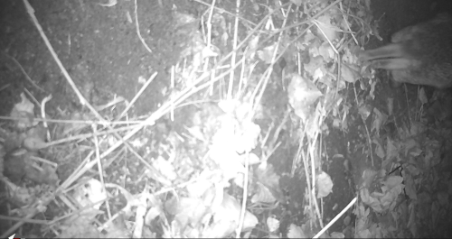

* Some of the cameras were positioned sideways or upside down.
  However, the camera is smart enough to realize this and adjust.
  However, I can't just rotate the images, as the camera sort of adjusts, saving the images
  as though they were vertical (with the spy-camera meta-data oriented correctly and
  usually along the bottom of the image, even if the image itself is still upside down or sideways).

  In this example you can see that the stealth camera has correctly put the footer at the bottom
  of the image, even though the world in the picture is sideways (looking down a culvert/pipe
  towards the far opening of the pipe).

  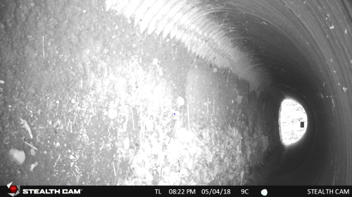

* A huge percentage of the pictures are taken in the dark (like the two exmaple images above),
  so images are the classic infrared grey-scale images, and are frequently washed out
  (sometimes it is hard to tell where the background ends and the animal starts)
  with bright reflections from the eyes, etc. (there is an example of such an image father down).

* The data is incredibly skewed; the vast majority (99+%) of the images do not contain any
  wildlife at all, so training a new AI will also be challenging.

* Only some of the 4TB of image data I was provided was already reviewed and tagged;
  the tagged data were stored in Excel files with different formats for each site/folder of images.

#### Example image

### Failed approach: image subtraction

So at first I thought an image subtraction algorithm might help reveal the animals -
highlighting differences between the frames.

Unfortunately, this idea did not work either, as the outdoor cameras subtly swayed in the wind,
tilting and moving significantly between frames.  This caused image differences to be dramatic
even when there was no real visible change in the frame.

Furthermore, various background features such as plastic fencing waving in the wind,
or distant windmills slowly turning also caused lots of irrelevant differences in the images.
Shadows slowly moving across the camera's field of view also resulted in huge irrelevant image
deltas between frames.

Perhaps the worst offenders were cameras positioned at the top of a culvert that had slowly moving
water in the bottom of the ditch, sloshing back and forth floating leaves, sticks,
and other flotsam.

## The process

Given the challenges above, I decided to try and build/train an AI model from scratch
leveraging the numerous and well documented image recognition approaches available.

I received 4TB of images from NRSI, in a very deep directory structure that was highly
inconsistent, but usually looking something like:

* `<site>/<sd-card-#>/<date-range>/DCIM/100STLTH/*.jpg`
* `<site>/<sub-site-#>/`
* etc..

The process I followed to get to a solution was long and circuitous...

1. Tag the images that had animals

   For this I built a small image tagging utility with Tcl/Tk (which I used back in university)
   and [Tkinter](https://docs.python.org/3/library/tk.html).

   The UI is incredibly minimal, with a focus on keyboard shortcuts rather than a complex UI.

   However, I quickly realized how long it was going to take to process 10,000s of images!

   I updated the tool to automatically scan through images without my pressing a button -
   every 0.5 seconds it moves to the next image.  If I see something interesting I can use the
   arrow keys to stop the auto-scan and manually move left and right between images,
   using the mouse to tag the animal within the image:

   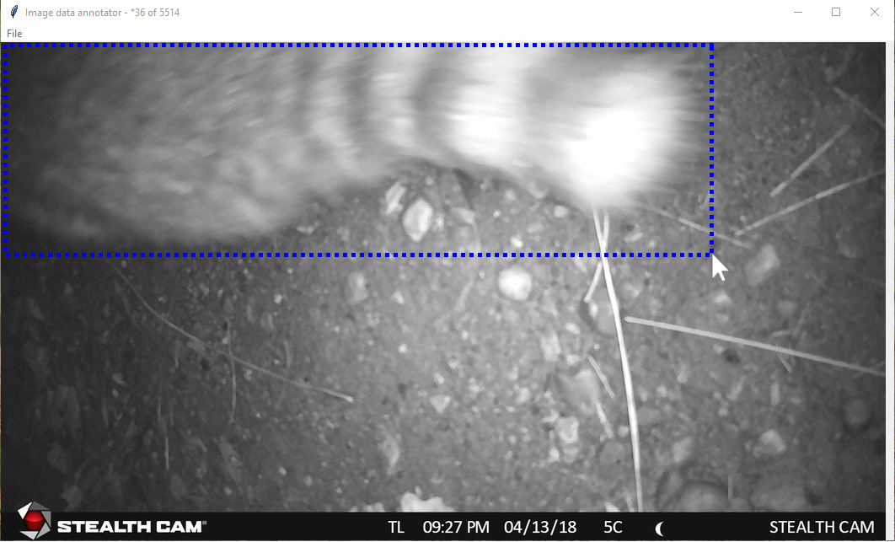

   However, many folders contain 10,000 images, which was still taking hours to process.

   Talking with NRSI they called my attention to Excel files in some of the sub-folders that
   detailed the tagging results NRSI has already performed!

2. Extract the previously tagged images from the various Excel files.

   This proved to be slightly more challenging than I initially expected, as each of the
   Excel files had its own format, and none contained full file paths but just path fragments,
   (often skipping directories in the path such as the `<SD card #>` or `DCIM` folders)
   assuming users were familiar with the NRSI naming convention.

   I ended up building a few [utility Python scripts](utils\excelFileUtils) to help extract the
   tagged data into a `.CSV` file, and did a few other Excel files by hand
   (because those Excel files had data was easier to work with directly in Excel).

3. Augment with "surrounding" pictures

   I wanted to capture a few images both before and after those positively tagged images,
   so I wrote [`addSurroundingImages.py`](./utils/addSurroundingImages.py) to expand
   on the CSV file with those additional images.

   Going through these additional images with the tagging UI tool it became apparent that the
   NRSI tagging data was not complete.  They only recorded one image for a particular animal,
   even if that animal was in multiple photographs (either before or after the image that
   NRSI had tagged in the Excel file).

   Obviously this would be a problem if I used those (incorrectly tagged) "negative" images
   for training an AI model.
   So I went through the extended image set by hand tagging all of the animals in the surrounding
   images as well.

   This lengthy effort was beneficial as it added a significant number of
   positively tagged images in the training data set I am building.

4. Extract sub-images from the tagged images

   I wrote [`training_sub_image_extraction.py`](src\training_sub_image_extraction.py)
   to break-down the tagged images into smaller 128x128 sub-images that
   I can feed into an AI image recognition model training process.

   In many of the NRSI tagged images I couldn't find the animal without bouncing back and forth
   between it and the previous image - looking for the slight variances in the images.

   For this reason I am still using the image subtraction when generating the 128x128 sub-images.
   I am hoping that by using the image deltas it can draw attention to animals -
   even in grainy infra-red images - and make it easier for the AI model to learn what I
   want it to find.

   Along the way I merged my Tcl/Tk UI git repo with this new more AI focused code and the Excel
   utilities, so that everything now shares a [common model](./src/model) and
   [JSON data serialization](src\data_serialization_json.py) code.

5. Fixing my data tagging error

   Unfortunately, reviewing the generated delta sub-images from the previous step,
   it quickly became apparently that a number of positively tagged sub-images looked exactly
   like the negatively tagged delta sub-images.

   The reason quickly became apparent:  I had used a single rectangle to tag most animals,
   and due to the animal's position that rectangle often included a significant amount of the
   picture that did NOT include the animal.

   For example, I had previously tagged the following rabbit with a single rectangle.
   However, breaking up this rabbit rectangle into 128x128 sub-images included the three red
   sub-images, which clearly don't include any rabbit and whose delta with the previous frame
   was obviously exactly like a negatively tagged detla sub-image:

   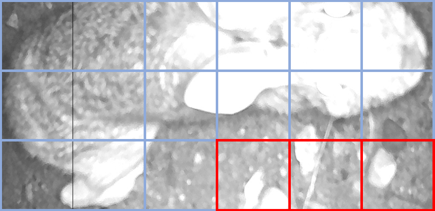

   So I ended up going back through all the tagged images and fixing up their tagged regions.

   So the above rabbit - previously tagged with a single rectangle - is now tagged like this:

   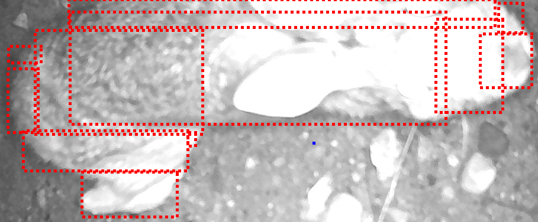

    It doesn't really matter if the tagging rectangles are overlapping like this.
    I only use them to determine if a particular 128x128 sub-image should be positively
    or negatively tagged - testing each 128x128 sub-image with all the tagged regions in an image.
    Only if they do overlap is the sub-image positively tagged.

    With the images **re**-tagged I re-ran the
    [`training_sub_image_extraction.py`](src\training_sub_image_extraction.py) script and produced
    my first set of training data.

6. Leveling the playing field

    However, I now had a few thousand positively tagged images, and many tens of thousands of negatively
    tagged images.   So I still have a seriously skewed set of training data.

    To fix this I used two approaches:

    1. Create more
       [positively tagged sub-images](https://github.com/RobertMcCarter/animal-ai/blob/main/src/training_sub_image_extraction.py#L181-L224)

        I export not just the sub-image, but also take the sub-image and:
        * flip it horizontally
        * flip it vertically
        * flip it both horizontally and vertically
        * rotate it 90° clockwise
        * rotate it 90° counter-clockwise

        Given that the cameras are frequently installed sideways or upside down, these manipulations
        should only help the AI training.

    2. I [do not export all the negatively tagged images](https://github.com/RobertMcCarter/animal-ai/blob/main/src/training_sub_image_extraction.py#L227-L247)

       I randomly select only [`7.5`%](https://github.com/RobertMcCarter/animal-ai/blob/main/src/training_sub_image_extraction.py#L246)
       of the negatively tagged sub-images for export.

    With this new approach I have
    * 82,614 positively tagged images in my `true` data folder that look like this:

        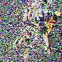
        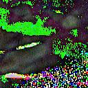
        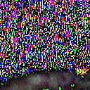

    * 88,382 negatively tagged images in my `false` data folder that look like this:

        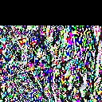
        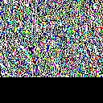
        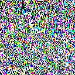

        The black bars are areas where the subtraction from the previous frame had no differences
        whatsoever.

    Obviously I am hoping that making the two classes more even in quantity will simplify training
    the AI model, which is now (finally) the next step.

You're all caught up on my progress!
